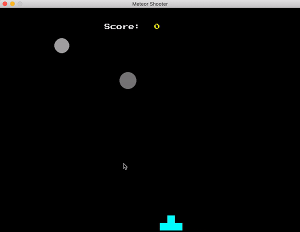

# 🎮 Meteor Shooter Game 🚀

Welcome to **Meteor Shooter**! This is a classic arcade-style game where you control a neon blue gun and shoot at falling meteors. The bigger the meteor, the more points you score! Watch out, though—miss too many meteors, and the game will end!

## 🎯 How to Play

1. **Move Left/Right**: Use the arrow keys to move your gun left or right.
2. **Shoot**: Press the SPACE bar to fire bullets at the meteors.
3. **Score Points**: Destroy meteors to score points. Bigger meteors give you more points!
4. **Avoid Misses**: Try not to let too many meteors fall past the bottom of the screen. Miss 10 meteors, and it’s game over!

## 🌟 Features

- **Neon Blue Gun**: A cool, retro-inspired gun to shoot with.
- **Different Meteor Sizes**: Bigger meteors mean more points!
- **Score System**: Keep track of your score and aim for high scores!
- **Game Over Screen**: See your final score and choose to restart or quit when the game ends.

## 📸 Watch the Game in Action!

Check out this GIF to see the game in action and how the game ends when 10 meteors are missed:



## 🏆 Installation

To get started with Meteor Shooter, follow these steps:

1. Clone the repository:
   ```bash
   git clone https://github.com/yourusername/meteor-shooter-game.git
   ```

2. Navigate to the project directory:
   ```bash
   cd meteor-shooter-game
   ```

3. Install the required Python packages:
   ```bash
   pip install pygame
   ```

4. Run the game:
   ```bash
   python arcade_game.py
   ```

## 📝 License

This project is licensed under the MIT License. See the [LICENCE](LICENCE) file for details.

## 👋 Contributing

If you have any suggestions or improvements, feel free to fork the repository and submit a pull request!

Happy shooting! 🚀💥
